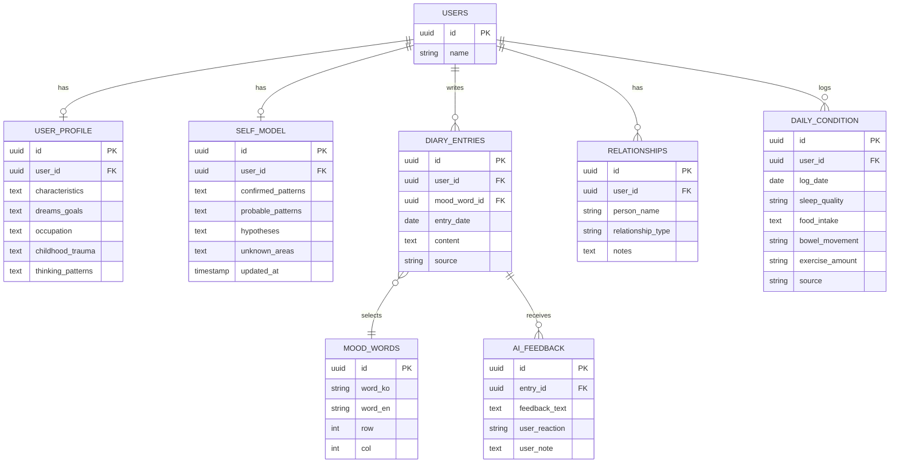
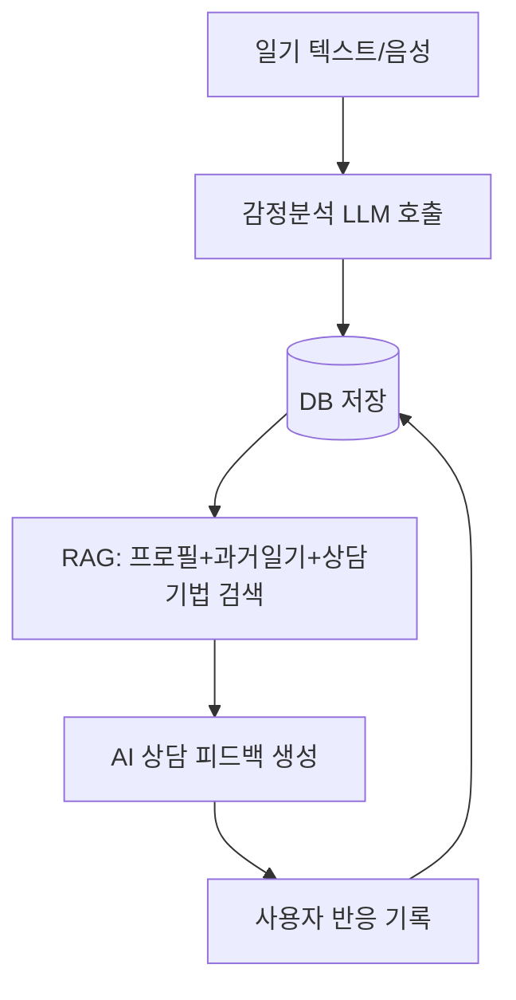
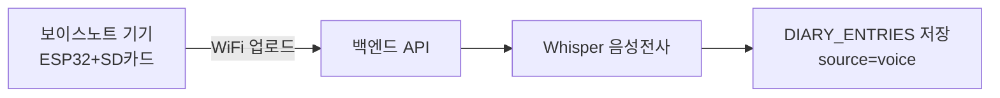

# MoodNote — AI 녹음기 + 감성일기 프로젝트

**2026-2학기 지능형시스템프로젝트 졸업작품 | 팀: 유정(SW/기획), 코딩 담당(SW), 하드웨어 담당(HW)**

---

## 1. 프로젝트 비전

일기를 쓰면 AI가 내용을 분석해 무드 그래프로 시각화하고, 그 감정 상태를 바탕으로 AI가 맞춤 상담 피드백을 제공하는 앱입니다. 별도로 개발하는 **보이스노트 기기(음성 녹음 하드웨어)**로 녹음한 음성이 자동으로 전사되어 일기로 등록되며, 이는 향후 웨어러블 데이터 연동으로 확장 가능한 구조로 설계했습니다.

**이번 학기 목표(졸작)**: 소프트웨어(일기+AI상담+무드그래프) + 하드웨어(보이스노트 기기) 통합 MVP 완성
**제외 범위(향후 확장)**: 아이패드 손글씨 버전, 웨어러블 생체신호 직접 연동

---

## 2. 전체 로드맵 및 현재 위치

| 단계 | 상태 | 비고 |
|---|---|---|
| 스코프 확정 (SW+HW 두 트랙) | ✅ 완료 | 아이패드 손글씨는 향후 확장으로 보류 |
| 팀 역할분담 | ✅ 완료 | 유정: SW/기획, 코딩담당: SW구현, HW담당: 하드웨어 |
| DB 스키마 설계 | ✅ 완료 (본 문서 3절) | 코딩 착수 가능한 상태 |
| 감정분석 로직 설계 | 🟡 설계 완료, 구현 착수 전 | 무드미터 100단어 좌표표 방식 확정, 데이터 입력 진행중 |
| AI 상담 프롬프트 (`prompt.md`) | 🟡 초안 있음, 팀 공유 전 | GitHub 업로드 예정 |
| HW 펌웨어 개발 | ⚪ 예정 | API 규격 — **오늘 회의에서 확정** |
| 백엔드 API 구현 | ⚪ 예정 | 스키마 확정되어 바로 착수 가능 |
| RAG 챗봇 설계 | ⚪ 예정 | 감정분석+DB 완료 후 착수 |
| SW·HW 통합 테스트 | ⚪ 예정 | |

---

## 3. 데이터베이스 스키마

**테이블별 역할 요약**

- **MOOD_WORDS** — 무드미터 100개 감정 단어의 좌표표 (row 1~10=에너지, col 1~10=유쾌함). 사용자가 일기 쓸 때 이 중 하나를 선택 → AI가 숫자를 추측하지 않고 정확한 좌표를 바로 얻음
- **DIARY_ENTRIES** — 일기 본문. `source` 필드로 텍스트/음성(보이스노트 기기)/향후 손글씨 구분
- **AI_FEEDBACK** — AI 상담 피드백 + 사용자의 실제 반응(도움됨/별로였음). AI 자체평가가 아니라 사용자 판단 기반
- **SELF_MODEL** — 대화가 쌓일수록 AI가 갱신하는 사용자에 대한 이해 (확정패턴/probable/가설/미지영역). RAG가 상담 시 참고
- **USER_PROFILE / RELATIONSHIPS / DAILY_CONDITION** — 비교적 안정적인 사용자 배경 정보. 매 일기마다 반복 저장하지 않도록 분리

---

## 4. 소프트웨어 아키텍처

**LLM 실행 환경**: 학교 AI서버의 오픈소스 LLM(한국어 모델) 사용 예정 — 별도 API 비용 없음, 정신건강 데이터가 외부로 나가지 않는 구조

---

## 5. 하드웨어 연동 구조

**⚠️ 오늘 회의에서 확정할 것 — API 규격(초안)**

| 항목 | 초안 제안 |
|---|---|
| 엔드포인트 | `POST /api/voice-entries` |
| 전송 데이터 | 음성 파일(멀티파트), device_id, 녹음 시각 |
| 인증 | 기기별 고정 토큰(단순 API key) |
| 백엔드 처리 | 전사(Whisper) → DIARY_ENTRIES에 source="voice"로 저장 |

펌웨어는 녹음+WiFi업로드만 담당, 전사·분석은 백엔드가 처리 (하드웨어 개발 부담 최소화)

---

## 6. 다음 액션 (담당자별)

- **유정**: MOOD_WORDS 100단어 CSV 완성, few-shot 프롬프트 예시 작성, `prompt.md` GitHub 업로드
- **코딩 담당**: 스키마 기반 DB 테이블 생성, 백엔드 API 골격 구현
- **HW 담당**: 회로 설계·부품 준비, 녹음 펌웨어 개발 (API 규격은 본 문서 5절 기준 확정)
- **공통**: 학교 AI서버 사용 신청 현황 공유
